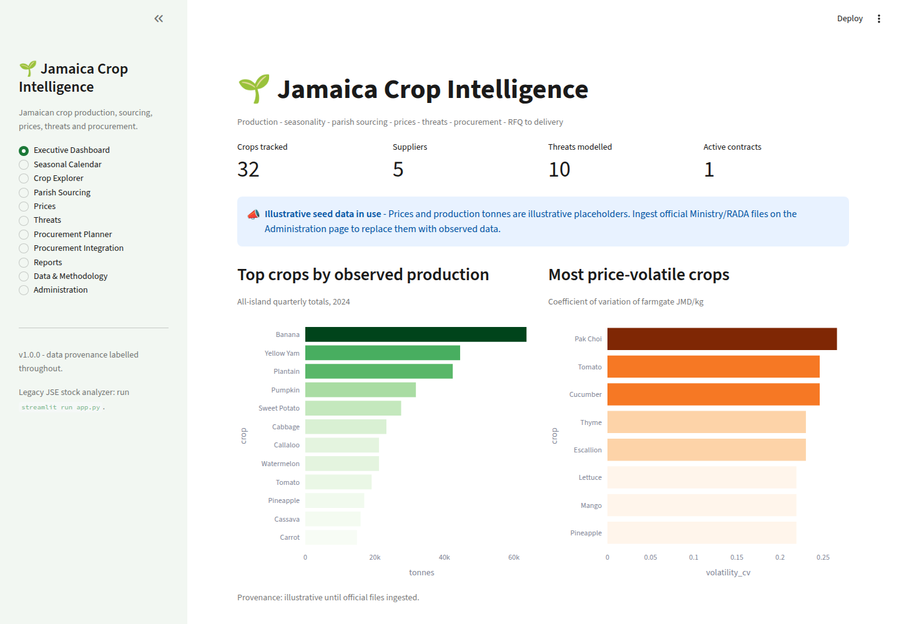
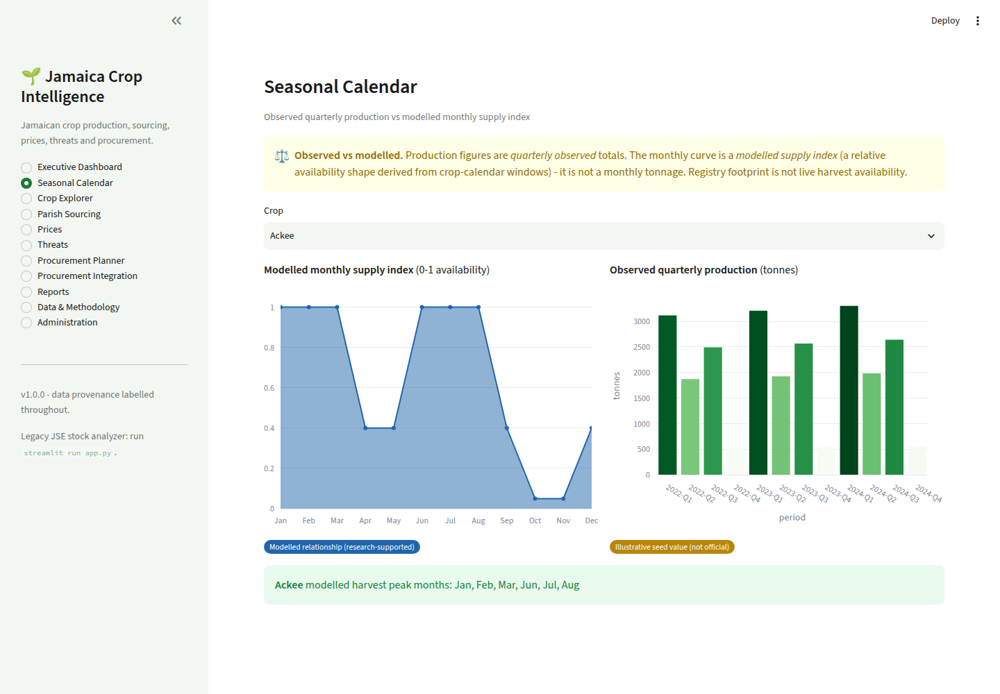
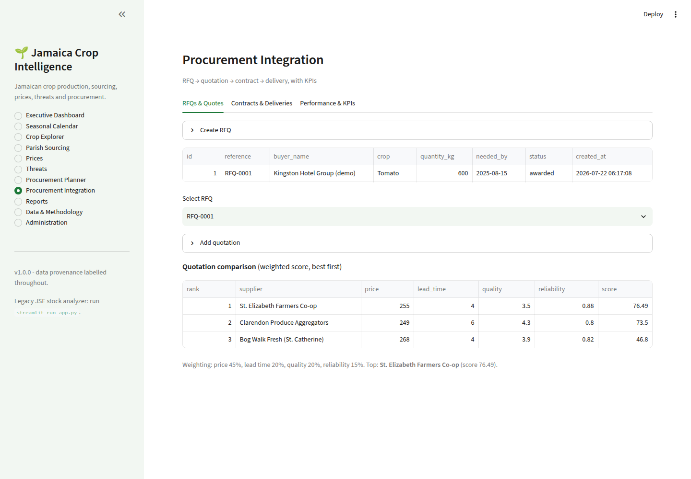

# Jamaica Crop Intelligence  🌱

An integrated Streamlit app connecting Jamaican **crop production, seasonal
availability, parish sourcing, prices, threats, procurement planning** and the
full **RFQ → quotation → contract → delivery** transaction lifecycle, over an
**official-data ingestion and stewardship** layer.

> Data provenance is labelled everywhere — observed vs modelled vs illustrative
> vs registry footprint. Quarterly production is never shown as monthly output;
> the monthly supply index is a *modelled* availability shape, not a tonnage.

## Run

```bash
pip install -r requirements.txt

streamlit run streamlit_app.py          # Jamaica Crop Intelligence (default)
streamlit run app.py                     # legacy JSE stock analyzer

pytest jamaica_crop_intelligence/tests -q
```

## What's inside

- **11 pages**: Executive Dashboard, Seasonal Calendar (observed vs modelled),
  Crop Explorer, Parish Sourcing, Prices, Threats, Procurement Planner,
  Procurement Integration (RFQ→delivery + KPIs), Reports (Excel export),
  Data & Methodology, Administration (ingestion).
- **Real Jamaican domain data**: 32 crops with aliases and seasonal windows, the
  14 parishes, markets, climate/pest/disease/security threats (including praedial
  larceny), and suppliers.
- **Official-file ingestion**: upload Ministry/RADA CSV/Excel/PDF → crop-name &
  unit normalization review → data-quality flags → approve/reject → idempotent
  commit into normalized fact tables.
- **Procurement analytics**: scored quotation comparison, contract fulfillment
  KPIs, supplier performance from actual deliveries, planned-vs-actual, and
  shortages/rejections reporting.

See the module guide: [`jamaica_crop_intelligence/README.md`](jamaica_crop_intelligence/README.md).

## Screenshots

Major pages are captured in [`docs/screenshots/`](docs/screenshots/).

| Dashboard | Seasonal Calendar | Procurement Integration |
|---|---|---|
|  |  |  |

## Deploy

Deploy to Streamlit Community Cloud with main file `streamlit_app.py`.
Full steps: [`output/deployment_instructions.md`](output/deployment_instructions.md).
Source register and honesty notes: [`output/source_register.md`](output/source_register.md).

---

## Legacy app — JSE Financial Statement Analyzer (`app.py`)

The original Streamlit app for analysing companies listed on the Jamaica Stock
Exchange remains available and unchanged. Pick a company and drill into any line
item on its Income Statement, Balance Sheet or Cash Flow Statement to see how it
changed over time, its growth, its share of the relevant total, a plain-language
read of what drove the change, the ratios it feeds into, and a simple valuation.
Figures are read live from stockanalysis.com. Run it with `streamlit run app.py`.
